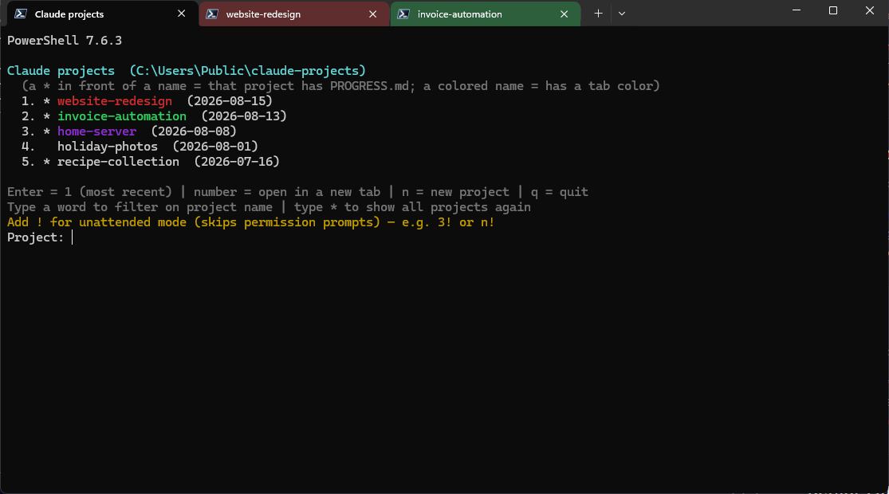

# Claude project chooser

A small script for people who keep all their Claude Code projects in one folder. It shows your projects as a numbered list, you pick one, and it opens in its own terminal tab or window with Claude Code started in the right folder. The chooser itself stays open, so you can start several projects one after another.

Two versions with the same behaviour: `Start-ClaudeProject.ps1` for Windows (PowerShell, Windows Terminal) and `claude-project` for Linux (bash). They share the `.tab-colors.json` file, so a project keeps its color across machines.

Every project gets its own color the first time you open it. The tab gets that color and the project name in the list is printed in it, so you can tell your projects apart at a glance.



## What you need

- Windows with Windows Terminal
- PowerShell 7 or newer (`pwsh`)
- Claude Code (`claude` must work in your terminal)

## Install

1. Put `Start-ClaudeProject.ps1` somewhere on your machine, for example `~\.local\bin`.
2. Tell it where your projects live: set the environment variable `CLAUDE_PROJECTS_ROOT` to that folder, for example `setx CLAUDE_PROJECTS_ROOT "D:\my\claude-projects"`. Without it, `~\Claude\projects` is used.
3. Start it with `pwsh -NoExit -File <path>\Start-ClaudeProject.ps1`. A desktop shortcut with exactly that command works well.

## Linux

`claude-project` is the same chooser in bash. Tested on Arch (Omarchy/Hyprland with foot) and meant for a Docker/NAS container with tmux as well.

What you need: bash 4 or newer, `jq`, Claude Code, and either a desktop terminal that `xdg-terminal-exec` (or `$TERMINAL`) can open, or tmux.

1. Put `claude-project` on your `PATH`, for example `ln -s "<repo>/claude-project" ~/.local/bin/claude-project`, and make it executable: `chmod +x <repo>/claude-project` (git and OneDrive do not carry the execute bit).
2. Set `CLAUDE_PROJECTS_ROOT` in `~/.bashrc`, for example `export CLAUDE_PROJECTS_ROOT="$HOME/OneDrive/Claude/projects"`. Without it, `~/Claude/projects` is used.
3. Optional, so that a bare `claude` typed anywhere opens the chooser while `claude <arguments>` still runs Claude Code directly — add to `~/.bashrc`:

   ```bash
   claude() {
     if (($# == 0)) && command -v claude-project >/dev/null; then claude-project; else command claude "$@"; fi
   }
   ```

How a chosen project opens is picked automatically: inside tmux it becomes a new tmux window (named after the project, with the project color in the status line); on a desktop it becomes a new terminal window (titled with the project name; on Hyprland the window border takes the project color); anywhere else Claude starts in the current terminal and the chooser returns when it exits. Force one with `CLAUDE_PROJECT_OPEN=window`, `tmux` or `inline`.

A project's place in the list follows the newest file inside it rather than the folder's own date, because a fresh OneDrive sync stamps every folder with the sync time.

## Use

| You type | What happens |
| --- | --- |
| Enter | opens the most recent project (number 1) |
| a number | opens that project in a new tab (Windows) or window (Linux) |
| `n` | asks for a name, makes that project folder (with a `PROGRESS.md` notes file) and opens it |
| `q` | closes the chooser |
| any word | filters the list on project name; several words means all of them must match |
| `*` | shows the full list again |
| `!` after a choice | unattended mode, see below |

Numbers always refer to the list as it is shown, so after filtering, `1` is the first project of the filtered list. A `*` in front of a name means that project has a `PROGRESS.md` file.

Extra arguments after the script name are passed on to `claude`, for example `--resume` or `--model` (on Linux: `claude-project --model opus`).

## Unattended mode

Add `!` to a choice (`3!`, `n!`, or just `!` for the most recent project) and Claude Code starts with `--dangerously-skip-permissions`: it acts without asking for permission first. The new tab or window shows a red warning and waits 5 seconds so you can still press Ctrl+C. Use this only for work you trust completely, such as a nightly run.

## Colors

The first time a project is opened it gets the next free color, and that pairing is saved in `.tab-colors.json` in your projects folder. A project keeps its color forever. Each new color sits 137.5 degrees further around the color circle, so every project's color clearly differs from all the earlier ones. Want a fresh start? Delete the file, or remove one project's line from it.

## License

MIT, see [LICENSE](LICENSE).
